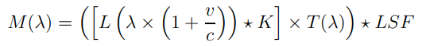

apogee_tools
============

``apogee_tools`` is a forward modeling framework for fitting atmospheric models to stellar spectra. Following from `Blake et al. 2010 <https://arxiv.org/abs/1008.3874>`_, we synthesize the model:

where `L` is the high resolution model template (parameterized by ``Teff``, ``logg``, and ``[Fe/H]``), ``v`` is the radial velocity, `K` is the rotational broadening kernel (parameterized by ``vsini``), T is telluric spectrum (with variable strength ``alpha``), and `LSF` is the line spread function of the instrument. Optimal fits and uncertainties are sampled using Markov Chain Monte Carlo, implemented via ``emcee`` (`Foreman-Mackey et al. 2012 <https://arxiv.org/abs/1202.3665>`_).

Contributors
------------

* Christian Aganze (UCSD)
* Jessica Birky (UCSD)
* Adam Burgasser, PI (UCSD)
* Dino Chih-Chun Hsu (UCSD)
* Elizabeth Moreno (Guanajuato)
* Chris Theissen (UCSD)

Code and documentation is maintained by Jessica Birky `here <https://github.com/jbirky/apogee_tools>`_, and is currently under construction. Feel free to contact jbirky@ucsd.edu with suggestions.

This code also borrows from several other sources, see:

* `Starfish <https://github.com/iancze/Starfish>`_ - Ian Czekala
* `apogee <https://github.com/jobovy/apogee>`_ - Jo Bovy
* `TheCannon <https://github.com/annayqho/TheCannon>`_ - Anna Ho

.. toctree::
   :maxdepth: 2
   :caption: User Guide:

   user/install
   user/instrument
   user/model
   user/analysis
   user/mcmc

Search
======

* :ref:`genindex`
* :ref:`modindex`
* :ref:`search`
